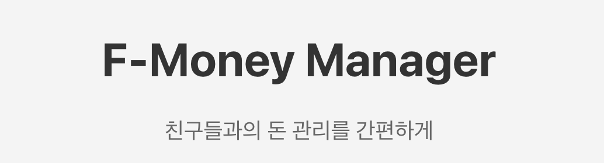
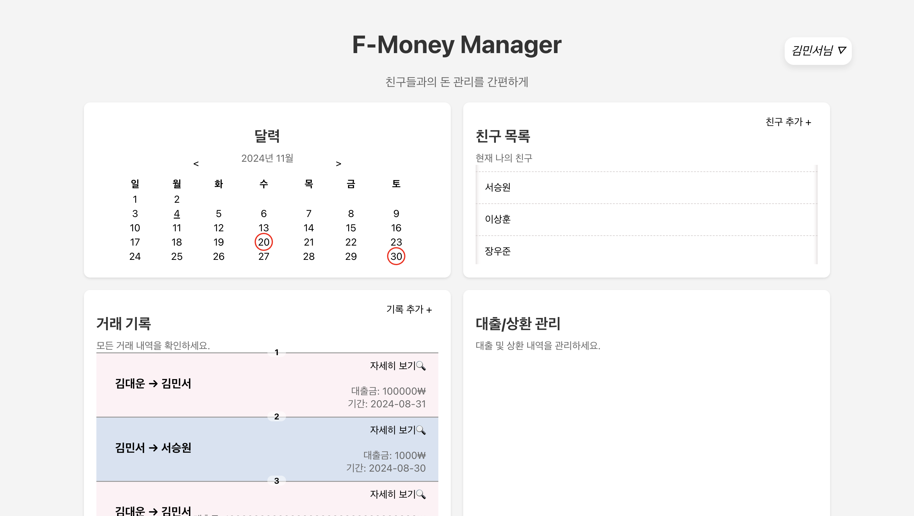
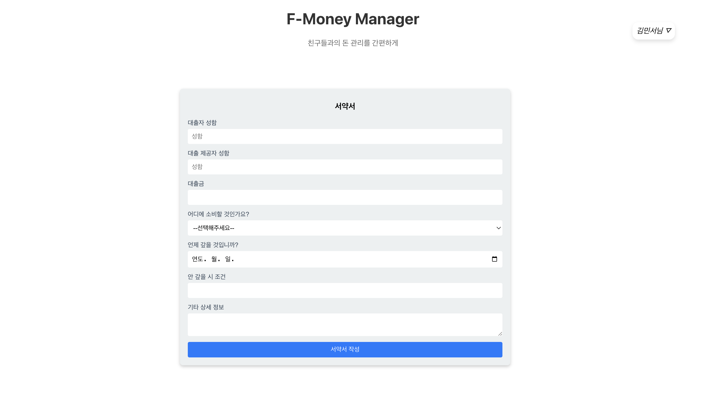
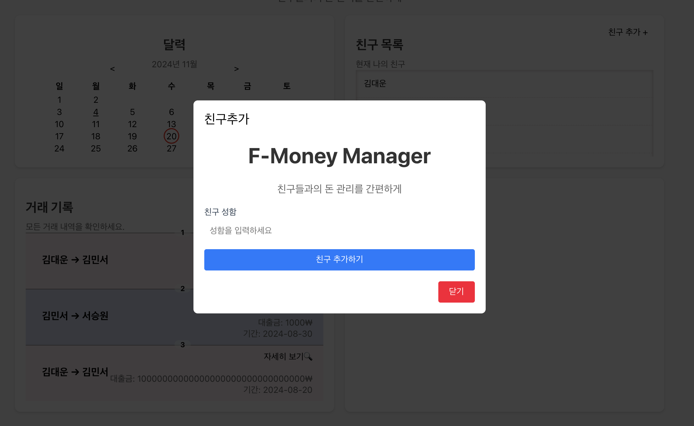
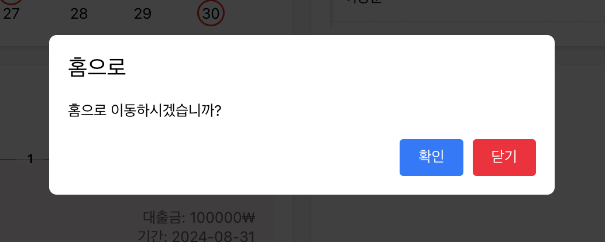
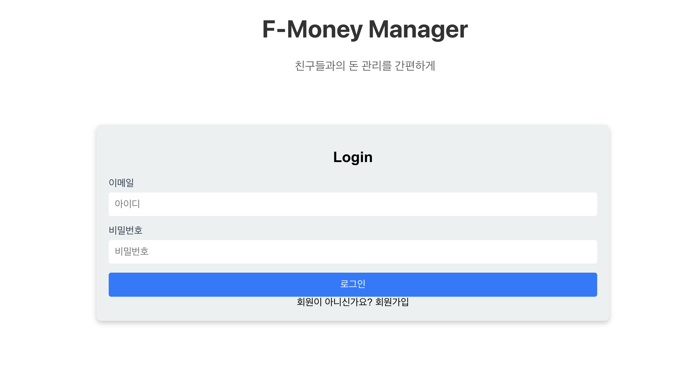

# F-Money Manager

### 프로젝트 소개
---
- 플랫폼: Web / 웹
- 제작인원: 1 인
- 제작 기간: 14 일 (2024.07.22 ~ 2024.08.06)
- 사용 기술: React, FireBase

'F-Money Manager'는 친구들과 함께 돈 관리를 더욱 간편하게 해주는 웹 애플리케이션입니다. 기존의 불편했던 금전 관리 방식을 개선하고, 기록을 통해 필요한 정보를 쉽게 확인할 수 있도록 돕습니다. 언제 어디서든 접근이 용이하며, 사용자는 손쉽게 지출 내역과 수입을 기록하고, 다양한 분석 정보를 통해 현금 흐름을 파악할 수 있습니다.

### 미리보기
--- 

메인 페이지

기록 추가 페이지

친구추가 모달창

홈버튼 모달창

로그아웃 모달창

로그인 페이지

회원가입 페이지

### 구현기능
---
- 회원가입
- 로그인
- 메인페이지
    - 달력
        - 결제일 기록
    - 기록 보기 (채권자, 채무자, 기간, 원금)
        - 기록상세 보기
        - 지출유형별로 색깔추가 (채무자가 회원이면 파란색, 채권자가 회원이면 빨간색)
    - 거래기록 추가
        - 대출자 성함
        - 대출 제공자 성함
        - 대출금
        - 소비 목록 ( 취미, 이제, 식비, 쇼핑, 의료, 보험 등등 9가지 )
        - 안 갚을 시 조건
        - 기타 상세 정보
    - 친구 추가
- 메뉴바
    - 홈 버튼 모달창
    - 로그아웃 모달창
- 친구
    - 친구추가 모달창
    - 친구 보기